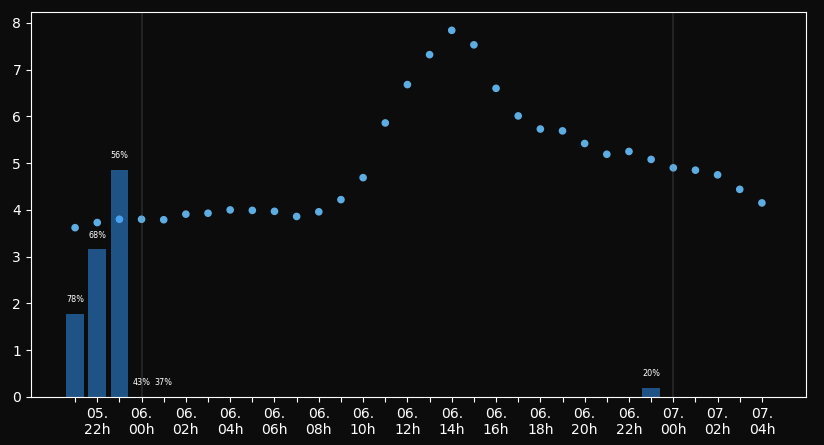

# conky-weather

A slick hourly weather graph for conky used in my [dotfiles](https://github.com/ivan-ristovic/dotfiles).



## How to use it?

Simply put the [weather_graph.py](./weather_graph.py) and [weather.conf](./weather.conf) inside your conky config directory (`~/.config/conky` by default). Invoke conky like so:
```
$ conky -c <YOUR_CONKY_CONFIG_DIR>/weather.conf -d
```

The script uses OpenWeather OneCall API, so you will need an 3.0 OneCall API key. The key can be placed in the `~/.apikeys` directory, or passed to the script via `OPENWEATHER_API_KEY` environment variable. Location can be specified via `LAT` and `LON` environment variables. The script caches the weather and updates every 30 minutes - the cached JSON response and chart are by default placed in the `/tmp` directory but that can be modified through `OPENWEATHER_HOURLY_{CACHE,CHART}_PATH` environment variables.

## Dependencies

- Python 3
- Matplotlib
